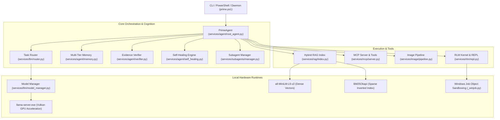
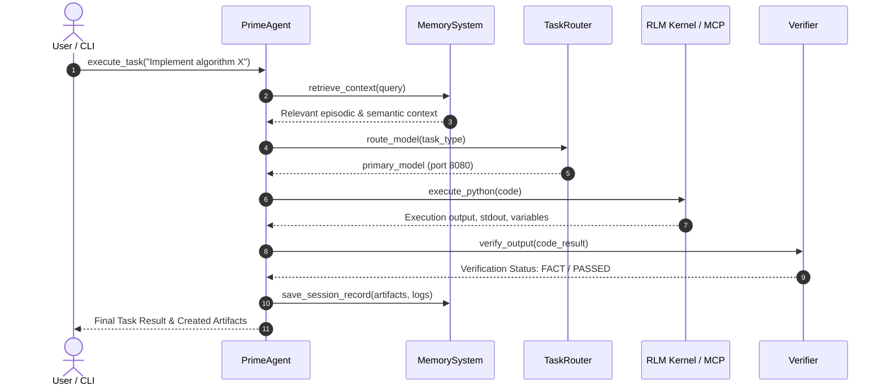

# System Architecture - Prime Agent Local RLM Platform

This document describes the high-level architecture, module decomposition, data flows, and design principles of the Prime Agent Local RLM Platform.

---

## 1. Architectural Philosophy

1. **Local-First & Offline Resilience**: All inferences, embeddings, vector indexing, image generation, and tool executions occur locally without external cloud dependencies.
2. **Headless Operation**: Designed from the ground up for autonomous execution via CLI, PowerShell scripts, and background daemon loops.
3. **Reality-First Verification**: Every output, tool invocation, and claim is grounded by concrete filesystem, REPL, or model outputs—zero simulated mocks.
4. **Isolated Sandboxing**: Execution of subagents and user code occurs in dedicated session directories with Windows Job Object process limits.
5. **Bounded Self-Healing**: Failed actions, compilation errors, or runtime exceptions are automatically captured and routed through a repair loop with a maximum retry ceiling.

---

## 2. High-Level System Architecture

---

## 3. Subsystem Breakdown

### 3.1 RLM Execution Kernel (`services/rlm/`)
- **`repl.py`**: Persistent, stateful interactive Python execution environment that retains variables, functions, and imported modules across invocations.
- **`_winjob.py`**: Native Windows Job Object bindings using `ctypes` (`kernel32.dll`) to enforce strict memory quotas and process tree termination.
- **`harness.py`**: Durable state journaling engine providing reversible snapshots, transaction logs, and checkpoint rollback.
- **`bash.py` & `bridge.py`**: Cross-platform shell abstraction bridging PowerShell, CMD, and Bash with configurable working directories and timeout guards.

### 3.2 LLM Model Management & Routing (`services/llm/`)
- **`model_manager.py`**: Lifecycle manager for `llama-server.exe` instances. Dynamically manages Vulkan/CPU backends, context window sizing, speculative decoding parameters (`--spec-draft-n-max 8`), and automatic port reclamation.
- **`client.py`**: High-performance asynchronous HTTP client communicating with OpenAI-compatible local endpoints. Captures prompt and decode token speeds.
- **`router.py`**: Task-aware router directing incoming prompts to primary (Qwen3-4B), draft (Qwen2.5-0.5B), vision (Qwen2-VL-2B), or abliterated models based on role, token budget, and complexity.

### 3.3 Hybrid RAG Subsystem (`services/rag/`)
- **`parser.py`**: Unified document parser handling Markdown, PDF, DOCX, HTML, JSON, and source code.
- **`chunker.py`**: Semantic boundary chunker preserving markdown headings, code blocks, and paragraph continuity.
- **`embeddings.py`**: Fast local dense sentence transformer model (`sentence-transformers/all-MiniLM-L6-v2`).
- **`index.py`**: Dual-channel index combining dense vector cosine similarity with BM25Okapi sparse keyword ranking.
- **`reranker.py`**: Reciprocal Rank Fusion (RRF) algorithm merging dense and sparse ranked lists into structured Evidence Packs.
- **`vision_rag.py`**: Multimodal OCR engine integrating VLM output into the global retrieval index.

### 3.4 Model Context Protocol (`services/mcp/`)
- **`policy.py`**: Security gate enforcing absolute directory containment, preventing path traversal attacks, and restricting command execution.
- **`tools.py`**: Standardized tools exposing filesystem operations (read, write, list), git, bash/powershell, python execution, and RAG retrieval.
- **`server.py`**: Standard JSON-RPC 2.0 MCP server over stdio / HTTP transport.
- **`client.py`**: Autonomous client capable of tool discovery, schema inspection, and invocation.

### 3.5 Multimodal & Image Generation (`services/image/`)
- **`pipeline.py`**: Diffusers-based Stable Diffusion engine supporting text-to-image and image-to-image transformations.
- **`store.py`**: Content-addressed artifact store calculating SHA256 checksums, metadata tracking, and persistence in `data/artifacts/`.
- **`qa.py`**: Visual Quality Assurance evaluator combining OpenCV computer vision heuristics (contrast, edge variance, color distribution) and VLM descriptive inspection.

### 3.6 Subagents & Delegation (`services/subagents/`)
- **`roles.py`**: Definitions for 9 specialized native agent roles:
  1. `LeadArchitect`
  2. `Coder`
  3. `Researcher`
  4. `VisionAnalyst`
  5. `CreativeDirector`
  6. `DevOpsEngineer`
  7. `QAEngineer`
  8. `SecurityAuditor`
  9. `SelfHealingAgent`
- **`protocol.py`**: Structured JSON messaging protocol for agent-to-agent delegation, task handoff, and synthesis.
- **`manager.py`**: Lifecycle supervisor ensuring bounded recursion (maximum depth 3) and workspace directory isolation under `data/sessions/<id>/`.

### 3.7 Autonomy, Memory & Self-Healing (`services/agent/`)
- **`root_agent.py`**: Main agent control loop coordinating planning, tool execution, output verification, and artifact production.
- **`memory.py`**: Multi-tier memory comprising Working Memory, Episodic Execution Logs, Semantic Index, and Long-Term Goal tracking (`goals.json`).
- **`verifier.py`**: Epistemic verifier classifying statements into FACT, EVIDENCE, INFERENCE, and UNKNOWN to enforce zero-hallucination.
- **`self_healing.py`**: Diagnostic supervisor that intercepts stack traces, syntax errors, and test failures, synthesizing targeted corrective patches.
- **`daemon.py` & `scheduler.py`**: Background runtime maintaining heartbeats, cron schedules, and asynchronous job monitoring.

---

## 4. End-to-End Workflow Execution Sequence

