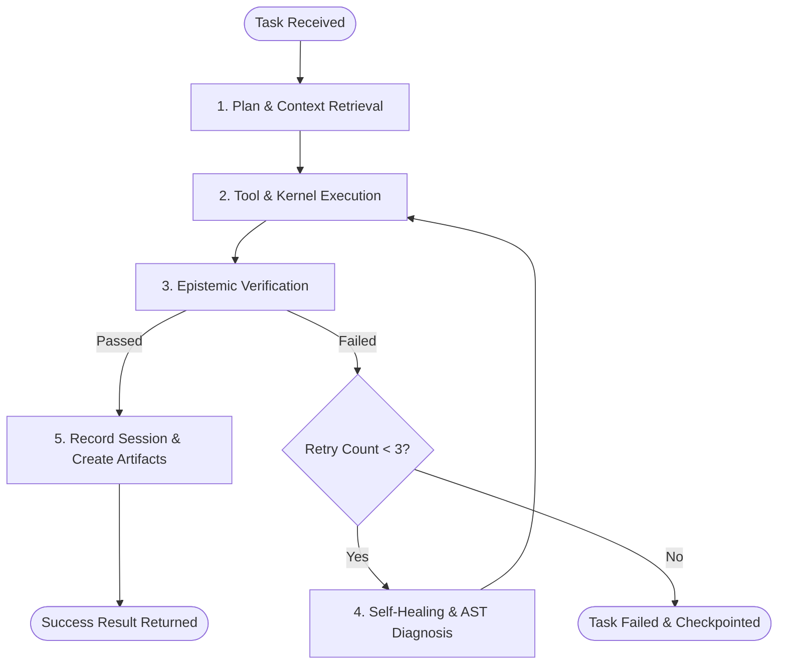

# Autonomous Execution, Verifier & Self-Healing

This document details the autonomous execution loop, epistemic verification engine, background daemon, and bounded self-healing supervisor of Prime Agent.

---

## 1. Autonomous Execution Loop (`services/agent/root_agent.py`)

The `PrimeAgent` execution loop follows a strict **Plan -> Execute -> Verify -> Heal -> Persist** pattern:

---

## 2. Epistemic Verifier Engine (`services/agent/verifier.py`)

To eliminate hallucination and guarantee factual rigor, the `EvidenceVerifier` categorizes claims and outputs into four epistemic categories:

1. **`FACT`**: A statement directly verified by deterministic code execution, filesystem existence, or an authoritative tool output (e.g., file exists, tests pass, hash matches).
2. **`EVIDENCE`**: Empirical data retrieved from authoritative indexed documents (RAG citations, commit history, system logs).
3. **`INFERENCE`**: Logical deductions synthesized by the LLM from FACTS and EVIDENCE. Must be explicitly tagged as derived.
4. **`UNKNOWN`**: Unsubstantiated statements or ungrounded assertions. Trigger verification warnings or re-execution.

### Verification Criteria:
- **Code Tasks**: Must compile cleanly (`ast.parse`), execute without non-zero exit codes, and pass all assertion checks.
- **RAG Tasks**: Must include explicit source file citations and matched text chunks.
- **Image Tasks**: Must satisfy minimum contrast, edge sharpness, and visual QA thresholds (`>= 0.6`).

---

## 3. Bounded Self-Healing Engine (`services/agent/self_healing.py`)

When an execution step throws an exception, encounters a syntax error, or fails unit tests:
1. **Diagnosis**: Parses traceback, extracts exact line numbers and exception types (`SyntaxError`, `ImportError`, `TimeoutError`, `AssertionError`).
2. **AST Analysis**: Inspects the Python AST to locate unbalanced brackets, undefined identifiers, or malformed calls.
3. **Targeted Repair**: Synthesizes a corrective diff or replacement snippet.
4. **Bounded Retries**: Strictly capped at **3 repair attempts**. If the issue cannot be resolved within 3 attempts, the system performs a state rollback via `harness.rollback_to(snapshot_id)` to restore a stable baseline.

---

## 4. Daemon & Scheduled Autonomy (`services/agent/daemon.py`, `scheduler.py`)

Prime Agent operates as a persistent Windows background service:
- **Heartbeat Loop**: Periodically (every 30 seconds) inspects registered goals, active subagent sessions, and hardware resource consumption.
- **Task Scheduler**: Executes recurring maintenance tasks (e.g., compaction of episodic logs, index refreshes, hardware temperature checks).
- **Graceful Control**: Started via `start.ps1`, monitored via `prime.ps1 status`, and stopped via `stop.ps1`.
