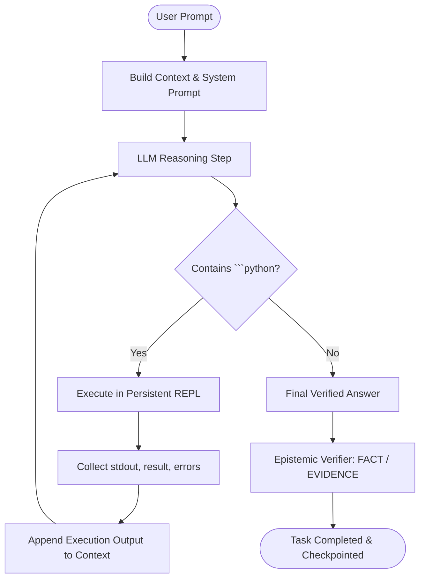

# RLM Execution Kernel & REPL Architecture

The Recursive Language Modeling (RLM) Kernel in Prime Agent provides a stateful, interactive, sandboxed Python and shell execution environment. It bridges high-level agent reasoning with deterministic code execution on the local host.

---

## 1. Core Principles & Architecture

1. **Stateful Continuity**: Variables, loaded datasets, defined functions, and imported modules persist across multiple agent execution steps in the same session.
2. **Iterative Autonomous Control Loop**: Rather than static one-turn text completions, the LLM outputs Python code blocks (````python ... ````) that execute directly in the persistent REPL. The stdout, expression results, and errors are fed back into the model's reasoning loop for continuous multi-step problem solving.
3. **Upstream Compatibility**: Provides top-level `rlm` package shim exposing:
   - `rlm.spawn(task, name, role)`
   - `rlm.collect(subagent_id)`
   - `rlm.harness` (`create_skill`, `update_skill`, `create_memory`, `create_strategy`, `get_harness_state`)
   - `rlm.bash(cmd)`
   - `rlm.emit(data)`
   - `rag.search(query, top_k)`
   - `image.generate(prompt, ...)`
   - `image.edit(prompt, image_path, ...)`
   - `mcp.call(server, tool, **args)`
4. **Reversible Snapshots & Checkpoints**: Complete state can be captured as an immutable snapshot using `dill` and rolled back if subsequent steps introduce errors or instability.
5. **Hard Resource Isolation**: Uses native Windows Job Objects (`kernel32.dll`) to enforce hard memory and CPU limits and guarantee that child processes are completely terminated.

---

## 2. Iterative RLM Agent Loop (`services/agent/root_agent.py`)



---

## 3. Persistent REPL (`repl.py`)

The `ReplSession` manages an asynchronous execution environment where each command runs in the context of previous evaluations.

### Key Capabilities:
- **Expression Evaluation**: Automatically returns the value of the last evaluated expression (e.g., `x = 10; x * 2` returns `20`).
- **Standard Output Capture**: Captures both standard output (`stdout`) and error streams (`stderr`).
- **Top-Level Await**: Full support for `await` expressions without boilerplate event loop wrappers.
- **Variable Inspection**: Exposes global namespace inspection allowing the agent to query defined variables and types.

---

## 4. Upstream-Compatible Harness Integration (`services/rlm/harness.py`)

The `HarnessStateManager` provides a transactional state ledger for agent actions:

- **Skills Lifecycle**: `create_skill(name, description, content)`, `update_skill(name, content)`, `delete_skill(name)`.
- **Memory Lifecycle**: `create_memory(key, value, global_=False)`, `delete_memory(key)`.
- **Strategy Management**: `create_strategy(name, content)`, `delete_strategy(name)`.
- **Immutable Base Safety Policies**: Core safety policies (`policy_zero_mocks`, `policy_path_sandbox`, `policy_bounded_healing`) are marked `immutable=True` and cannot be deleted or modified by agent actions.
- **Snapshots & Rollback**: Automatic pre-refinement snapshots with instant rollback via `rollback_to(snapshot_id)`.

---

## 5. Shell & Bridge Execution (`bash.py`, `bridge.py`)

- **Cross-Platform Compatibility**: Automatically wraps commands via `pwsh.exe -NoProfile -Command ...` on Windows while accepting standard Unix-like shell syntax.
- **Background Handles (`BashHandle`)**: Supports background shell execution with `poll()`, `tail()`, and `kill()`.
- **Non-Zero Exit Handling**: Returns structured `exit_code`, `stdout`, `stderr`, and `duration`.
